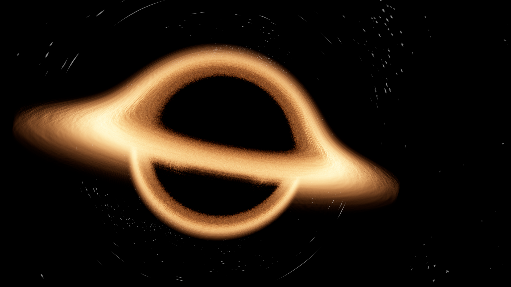

# Black Hole Renderer

## Description

A black hole renderer built in Rust with Wgpu. By making use of accurate general relativity, the black hole is rendered as it would appear in the real world (theoretically).

This branch contains the interactive version of this project in which the camera can be moved in real-time. For the non-interactive version of this project, visit the "master" branch.

## Output

## Credits

- [Mykhailo Moroz "Visualizing General Relativity"](https://michaelmoroz.github.io/TracingGeodesics/)
- ["Black-body Gradient" - Shadertoy](https://www.shadertoy.com/view/tsKczy)
